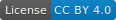
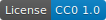
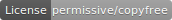

# Copyright {#about_copyright}

| Summary                   |                                                                                        |
|---------------------------|----------------------------------------------------------------------------------------|
| Copyright holders         | Knut Reinert, [FU-Berlin](https://fu-berlin.de), [MPI MolGen](https://molgen.mpg.de/)  |
| Library source code       |                                                 |
| Documentation             |                                                 |
| Snippets and examples     |                                                  |
| Dependencies              |                                             |

# Source code license

The contents of this repository/directory, in particular the library
source code of SeqAn3, are licensed under the following terms:

```
Copyright (c) 2006-2020, Knut Reinert & Freie Universität Berlin
Copyright (c) 2016-2020, Knut Reinert & MPI für molekulare Genetik
All rights reserved.

Redistribution and use in source and binary forms, with or without
modification, are permitted provided that the following conditions are met:

    * Redistributions of source code must retain the above copyright
      notice, this list of conditions and the following disclaimer.
    * Redistributions in binary form must reproduce the above copyright
      notice, this list of conditions and the following disclaimer in the
      documentation and/or other materials provided with the distribution.
    * Neither the name of Knut Reinert or the FU Berlin nor the names of
      its contributors may be used to endorse or promote products derived
      from this software without specific prior written permission.

THIS SOFTWARE IS PROVIDED BY THE COPYRIGHT HOLDERS AND CONTRIBUTORS "AS IS"
AND ANY EXPRESS OR IMPLIED WARRANTIES, INCLUDING, BUT NOT LIMITED TO, THE
IMPLIED WARRANTIES OF MERCHANTABILITY AND FITNESS FOR A PARTICULAR PURPOSE
ARE DISCLAIMED. IN NO EVENT SHALL KNUT REINERT OR THE FU BERLIN BE LIABLE
FOR ANY DIRECT, INDIRECT, INCIDENTAL, SPECIAL, EXEMPLARY, OR CONSEQUENTIAL
DAMAGES (INCLUDING, BUT NOT LIMITED TO, PROCUREMENT OF SUBSTITUTE GOODS OR
SERVICES; LOSS OF USE, DATA, OR PROFITS; OR BUSINESS INTERRUPTION) HOWEVER
CAUSED AND ON ANY THEORY OF LIABILITY, WHETHER IN CONTRACT, STRICT
LIABILITY, OR TORT (INCLUDING NEGLIGENCE OR OTHERWISE) ARISING IN ANY WAY
OUT OF THE USE OF THIS SOFTWARE, EVEN IF ADVISED OF THE POSSIBILITY OF SUCH
DAMAGE.
```

# Documentation

The API documentation and manual are additionally provided under the
terms of the [Creative Commons Attribution 4.0 International License](https://creativecommons.org/licenses/by/4.0/).
This includes
  * doxygen-style comments within the library source code;
  * Markdown files and images in the `doc`-subfolder;
  * HTML or other representation produced from the above.

The source code examples and snippets within the documentation are
additionally provided under the terms of the
[Creative Commons Public Domain Dedication 1.0](https://creativecommons.org/publicdomain/zero/1.0/deed).
This includes:
  * source code files (`*.cpp`, `*.hpp`) in the `doc`-subfolder;
  * the contents of `test/snippet`.

# Submodules

This repository/directory may contain other projects' content in the
`submodules`-subfolder. We try to ensure that all dependencies are
permissively licensed (BSD/MIT/X11/ISC/Boost…), but please verify the
respective license files yourself.
